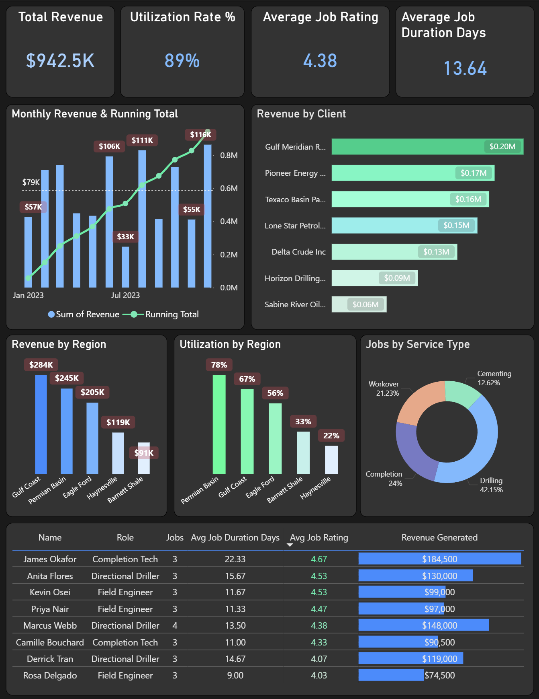
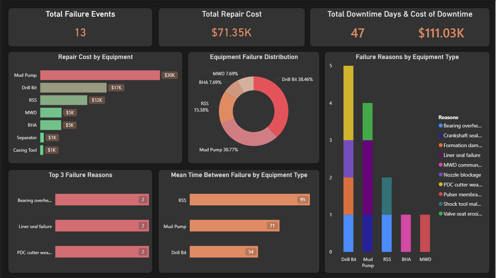

# Oilfield Services: Field Operations & Equipment Performance Analysis

## Project Overview

This project simulates a data analyst role at an oilfield services company (similar to Halliburton or Baker Hughes). The analysis focuses on **equipment reliability**, **field technician performance**, **service job efficiency**, and **revenue trends** across operating regions in Texas.

The dataset is synthetic but modeled after real operational structures used in oilfield services firms.

---

## Business Context

Oilfield services companies send crews and equipment to client well sites to perform drilling, completion, and maintenance services. Key business problems include:

- Minimizing equipment downtime (failures = lost revenue + safety risk)
- Optimizing technician deployment across regions
- Tracking job profitability by client, service type, and region
- Identifying trends in maintenance costs vs. revenue

---

## Database Schema

```
regions          → geographic service areas (Permian, Eagle Ford, Gulf Coast, etc.)
clients          → oil & gas companies (the customers)
wells            → well sites owned by clients
equipment        → company-owned tools and machinery deployed to jobs
technicians      → field staff performing services
service_jobs     → each job performed at a well site
maintenance_logs → equipment failure and maintenance records
```

### Entity Relationships

```
regions ──< wells ──< service_jobs >── equipment
                          │
clients ──< wells         │
                    technicians
                          │
                   maintenance_logs >── equipment
```

---

## Business Questions Answered

| # | Question |
|---|----------|
| 1 | Which equipment types have the highest failure rates? 
| 2 | What is the average job duration by service type and region? 
| 3 | Which clients generate the most revenue? 
| 4 | What is the mean time between failures (MTBF) per equipment type? 
| 5 | What is the monthly running total of revenue?
| 6 | Which technicians have the best performance metrics? 
| 7 | What is equipment utilization rate by region? 
| 8 | What is month-over-month revenue growth? 
| 9 | What are the top failure reasons per equipment type? 

---

## Key Findings

- **Strong Revenue Trajectory** The business is nearing the $1M mark ($942.5K) with a very healthy overall utilization rate of 89%. The running total shows consistent month-over-month growth, despite a significant dip in revenue around mid-2023
- **Client & Serivce Distribution** Revenue is relatively well-diversified across top clients, with Gulf Meridian Resources leading at $0.20M. Drilling operations are the clear core of the business, accounting for 42.15% of all jobs, followed by Completions at 24%.
- **Revenue vs. Utilization Mismatch** The Gulf Coast is your most lucrative region ($284K) but only has the second-highest utilization (67%). Conversely, the Permian Basin is working the hardest with the highest utilization (78%) but yields lower revenue ($245K). This suggests that jobs in the Gulf Coast command higher margins or higher-tier pricing compared to the Permian Basin.
- **Underperforming Zone** Haynesville has the lowest utilization (22%) but brings in more revenue than the Barnett Shale (33% utilization).
- **Downtime is the True Cost** The cost of operational downtime ($111.03K) heavily outweighs the actual physical repair costs ($71.35K). Every equipment failure is costing the business significantly more in lost time than in parts and labor.
- **The Mud Pump Problem**While Drill Bits fail the most frequently (38.46% of events), Mud Pumps are the biggest financial drain. They account for nearly half of your total repair costs ($30K) and have the second-lowest Mean Time Between Failure (71 days).
- **Predictable Failure Modes** The top three failure reasons—Bearing overheating, Liner seal failure, and PDC cutter wear beyond spec—are highly specific and evenly distributed. Drill bits are specifically suffering from PDC cutter wear beyond spec the most. Mud pump's major failure reason is Liner seal failure. RSS problems are Shock tool malfunction and Bearing overheating. For BHA and MWD, the failure reasons are MWD communication dropout and Pulser membrane failure respectively.
- **High-Value Completions** James Okafor (Completion Tech) is a massive outlier in revenue generation ($184,500) and holds the highest average job rating (4.67). While his average job duration is the longest (22.33 days), the financial return on his specific completion jobs is exceptionally high compared to standard drilling roles.
---

## Dashboards

### Financial & Operational Performance


### Equipment Reliability & Maintenance


---

## Tools Used

| Tool | Purpose |
|------|---------|
| SQL (PostgreSQL syntax) | Data modeling, transformation, and analysis |
| Power BI | Revenue and operations dashboard |
| GitHub | Version control and project documentation |

---

## Files

```
├── README.md
├── sql/
│   ├── 01_schema_and_data.sql     ← Table creation + synthetic data
│   └── 02_analysis_queries.sql    ← All 10 business question queries
└── visuals/
    └── Revenue_Operation_Overview.png
    └── Equipment_Reliability_Maintenance.png
```

---

## How to Run

1. Open any SQL environment (PostgreSQL, DBeaver, or DB Fiddle at dbfiddle.uk)
2. Run `01_schema_and_data.sql` first to create and populate all tables
3. Run queries from `02_analysis_queries.sql` individually or all at once
4. All queries are self-contained and commented

---

## Data Sources & Inspiration

- Schema modeled after oilfield services operational data structures
- Regional references based on Texas RRC production zone designations
- Equipment types based on publicly available Halliburton and SLB product catalogs
- Pricing ranges informed by EIA and industry reports

---

*Built as part of a SQL portfolio targeting data analyst roles in Houston's energy sector.*
